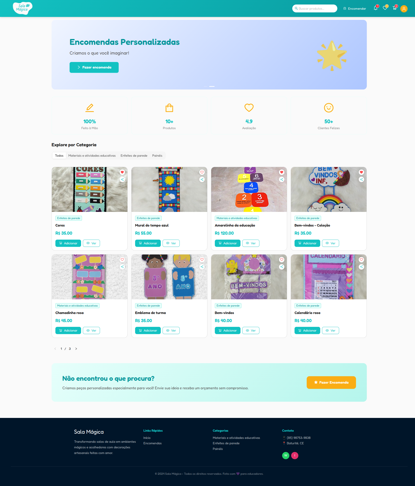
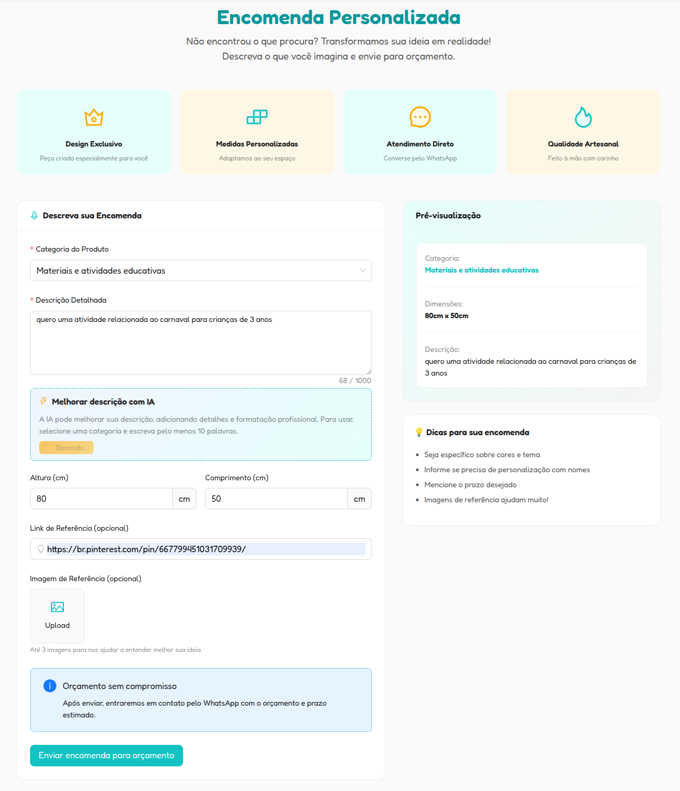
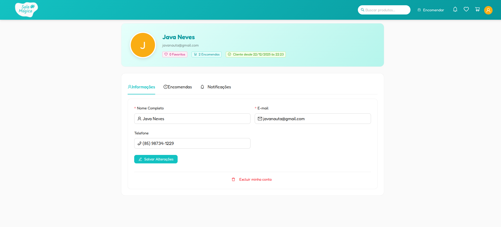
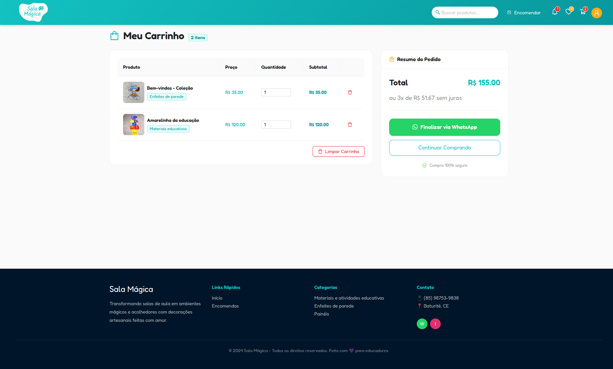

# Sala Mágica

A **Sala Mágica** é uma plataforma web desenvolvida como projeto freelancer para a divulgação e gestão de produtos artesanais voltados ao ambiente educacional (jardim de infância).  
O projeto passou por uma **refatoração completa**, onde apliquei boas práticas de arquitetura, separação de responsabilidades e tudo o que evoluí tecnicamente ao longo de 2025.

## 🎯 Objetivo do Projeto

Criar uma plataforma intuitiva e funcional para:
- Divulgar produtos artesanais
- Gerenciar encomendas personalizadas
- Facilitar o contato entre cliente e administradora
- Oferecer uma área administrativa segura e eficiente

## 🔁 Antes x Depois (Refatoração)

A versão original do projeto Sala Mágica foi desenvolvida no início do ano de 2025 para consolidar minhas habilidades em React.js, mas ao longo dos meses fui evoluindo meus conhecimentos e percebi que o projeto precisava de uma reestruturação completa, assim refatorei tudo para colocar meus conhecimentos em prática e oferecer a cliente uma plataforma mais segura.

**Antes**
- Código altamente acoplado
- Front-end e back-end compartilhando responsabilidades no mesmo código
- Dificuldade de manutenção e evolução

**Depois**
- API dedicada e desacoplada
- Front-end focado apenas na interface
- Melhor organização, escalabilidade e segurança
- Código mais limpo e reutilizável

## 🚀 Funcionalidades

### 👥 Usuários
- Cadastro e autenticação com Firebase Authentication
- Controle de permissões (user / admin)
- Atualização de perfil

### 🛍 Produtos
- Listagem pública de produtos
- Paginação, filtros e ordenação (🌟Nova funcionalidade)
- Dicionário de pesquisa para produtos (🌟Nova funcionalidade)
- Favoritar produtos
- Carrinho de produtos (🌟Nova funcionalidade)
- Compartilhamento e finalização de pedidos via WhatsApp

### 📦 Encomendas Personalizadas
- Envio de encomendas pelo site
- Sugestão de descrição com **IA** (🌟Nova funcionalidade)
- Acompanhamento do status da encomenda
- Comunicação facilitada com a administradora
- Sugestão de descrição do produto com **IA** (🌟Nova funcionalidade)

### 🔔 Notificações
- Sistema de notificações baseado em eventos (🌟Nova funcionalidade)
- Notificações por criação de produtos, atualizações nas encomendas
- Controle de leitura por usuário

### 🛠 Administração
- Área administrativa protegida
- Gerenciamento de produtos e categorias
- Acompanhamento e resposta de encomendas
- Fluxo completo do pedido (novo → análise → produção → finalizado) (🌟Nova funcionalidade)

## Arquitetura

- Aplicação de componentes da biblioteca Ant Design (🌟Novo)
- Separação clara entre **Front-end** e **Back-end**
- API REST construída com Express
- Uso de **Event Bus** para desacoplamento de ações (ex: notificações)
- Middlewares para autenticação e autorização
- Integração com serviços externos (Firebase, IA, WhatsApp)

## Tecnologias Utilizadas

### Front-end
- React
- TanStack
- TypeScript
- Ant Design
- Axios

### Back-end
- Node.js
- Express
- TypeScript
- Firebase Authentication
- Cloud Firestore

## 🖼 Demonstração

#### Página inicial

#### Fazer encomenda com sugestão por IA

#### Área administrativa

#### Área administrativa (Responder encomendas)
.png)

#### Perfil do usuário

#### Perfil do usuário (Visualizando pedido de encomenda)

#### Carrinho
